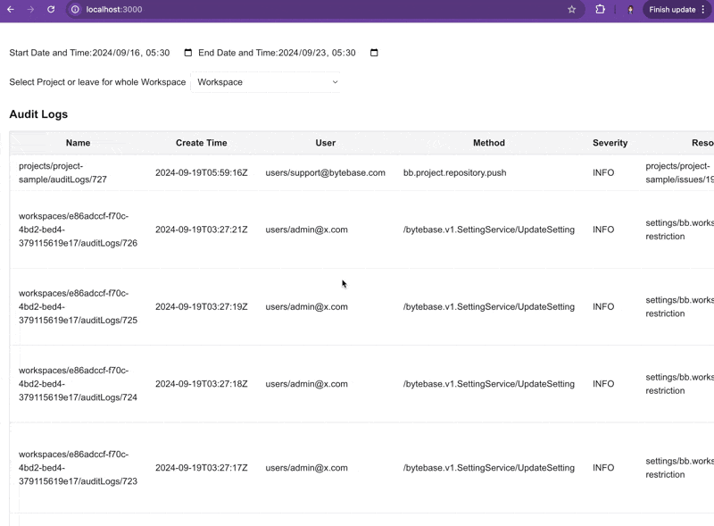

# Bytebase Audit Log API Example

This is a sample app demonstrating how to use [Bytebase](https://github.com/bytebase/bytebase) API to fetch and filter audit logs.



## Prerequisites

- Node.js >= 18
- A running Bytebase instance
- Bytebase service account with appropriate permissions

## Getting Started

### Step 1 - Start Bytebase

1. Follow the [Self-host Bytebase via docker](https://www.bytebase.com/docs/get-started/self-host/#docker) guide to set up Bytebase.
2. Create a [service account](https://www.bytebase.com/docs/how-to/spanner/how-to-create-a-service-account-for-bytebase/) with the necessary permissions.
3. Record the service account key.

### Step 2 - Configure and Run the App

1. Clone this repository.
2. Copy `env-template.local` to `.env.local`.

   ```bash
   cp env-template.local .env.local
   ```

3. Update the `.env.local` file with your Bytebase host and service account details:

   ```
   NEXT_PUBLIC_BB_HOST=your_bytebase_host
   NEXT_PUBLIC_BB_SERVICE_ACCOUNT=your_service_account
   NEXT_PUBLIC_BB_SERVICE_KEY=your_service_key
   ```

4. Install dependencies and run the development server:

   ```bash
   pnpm i && pnpm dev
   ```

5. Open [http://localhost:3000](http://localhost:3000) with your browser to see the running app.

## API Usage

This app demonstrates the use of the following Bytebase API endpoints:

- `/v1/auditLogs:search` - To fetch audit logs for the whole workspace
- `/v1/projects` - To fetch all projects
- `/v1/PROJECT_ID/auditLogs:search` - To fetch audit logs for a specific project

For more details on the Bytebase API, refer to the [official documentation](https://github.com/bytebase/bytebase/blob/main/proto/gen/grpc-doc/v1/README.md).


